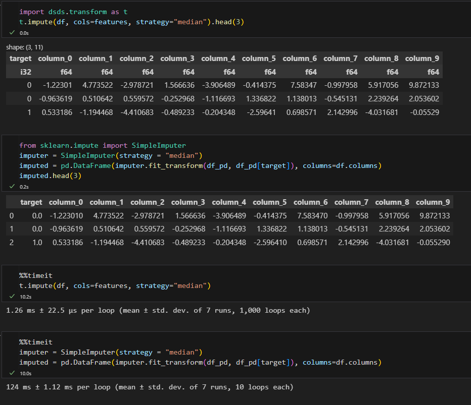
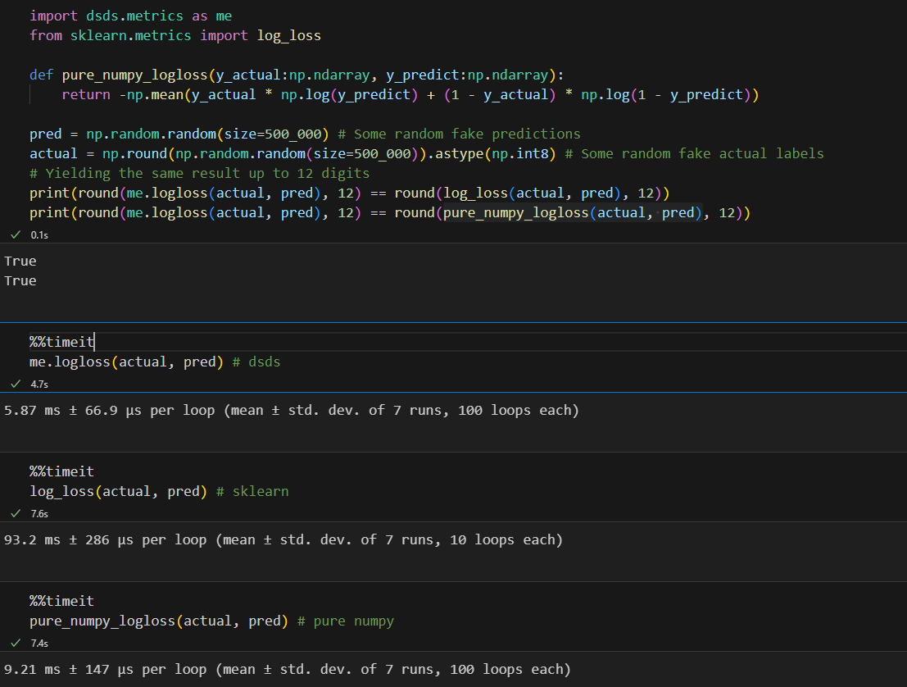

# Welcome to the DSDS

This package is in pre-alpha stage. Please read CONTRIBUTING.md if you are a developer interested in contributing to this package. This package requires the latest version of Polars.

Welcome to DSDS, an alternative data science package that aims to be an improvement over a subset of the following packages: sklearn, categorical encoder, and feature_engine, primarily in the following areas:

1. Providing practical feature prescreen (immediate detection and removal of useless featuers, data profiling, etc.)
2. Fast and furious feature selection and engineering using simple methods. It has significantly faster F-score, MRMR, mutual_info_score, better feature extraction APIs, etc.
3. Cleaner pipeline construction and management (See examples below.)
4. Compatible with Polars LazyFrames
5. Functional interface and fully typed functions for a better developer experience. No mixins, no multiple inheritance. No classes.
6. Even more performance for all of the above with the power of Rust!

DSDS is built around your favorite: [Polars Dataframe](https://github.com/pola-rs/polars)

## Usage

Practical Feature Prescreen
```python
from dsds.prescreen import (
    drop_if_exists,
    drop_by_pattern,
    drop_by_regex,
    drop_by_var,
    drop_highly_unique,
    drop_constants,
    drop_dates,
    drop_highly_null,
    infer_invalid_numeric,
    infer_conti,
    infer_emails,
    infer_nulls,
) # and a lot more!

```

Functional Pipeline Interface which supports both Eager and LazyFrames! And it can be pickled and load back and reapplied! See more in the examples on github.

```python
from dsds.prescreen import *
from dsds.transform import *

input_df = df.lazy()
output = input_df.pipe(var_removal, threshold = 0.5, target = "Clicked on Ad")\
    .pipe(binary_encode)\
    .pipe(ordinal_auto_encode, cols = ["City", "Country"])\
    .pipe(impute, cols=["Daily Internet Usage", "Daily Internet Usage Band", "Area Income Band"], strategy="median")\
    .pipe(impute, cols=["Area Income"], strategy = "mean")\
    .pipe(scale, cols=["Area Income", "Daily Internet Usage"])\
    .pipe(one_hot_encode, cols= ["One_Hot_Test"])\
    .pipe(remove_if_exists, cols = ["Ad Topic Line", "Timestamp"])\
    .pipe(mutual_info_selector, target = "Clicked on Ad", top_k = 12)
```

Performance without sacrificing user experience.



And yes, significantly faster than NumPy in many cases



## Dependencies

Python 3.9, 3.10, 3.11+ is recommended.

It should run on all versions >= 3.9.

Note: scikit-learn, lightgbm, xgboost and nltk are needed for full functionalities. 


# Why the name DSDS?

Originally I choose the name DSDS because it stands for Dark Side of Data Science. I thought it is kind of cool and since I am doing things differently, it justifies "dark side". I think data science/modelling infrastructure is the most foundational work that is also the most under-appreciated. Feature selection is often considered a dark art, too. So the name DarkSide/dsds really makes sense to me.

# Why is this package dependent on Sklearn?

You are right in the sense that this package does its best to separate itself from sklearn because of its focus and design. You do not need sklearn for pipelines, transformations, metrics, or the prescreen modules. However, for the fs (feature selection) module, right now there is no other high quality, tried and true package for random forest and logistic regression. The feature importance from these two models are used in some feature selection algorithms. Feel free to let me know if there are alternatives.

# Why not write more in Rust?

Yes. I am. I recently resumed working on traditional NLP, and this is an area where Rust really shines. It is well-known that Stemmers in NLTK has terrible performance, but stemming is an important operations for many traditional NLP algorithms. To combat this, I have decided to move stemming and other heavy string manipulations to Rust and leave only a very thin wrapper in Python. That said, using Rust can greatly improve performance in many other modules, not just dsds.text. But because development in Rust is relatively slow, I do not want to blindly 'rewrite' in Rust. In near future, I do not have plans to 'rewrite' in Rust, if performance gain is less than 10%.

# Contribution

See CONTRIBUTING.md for my contact info.